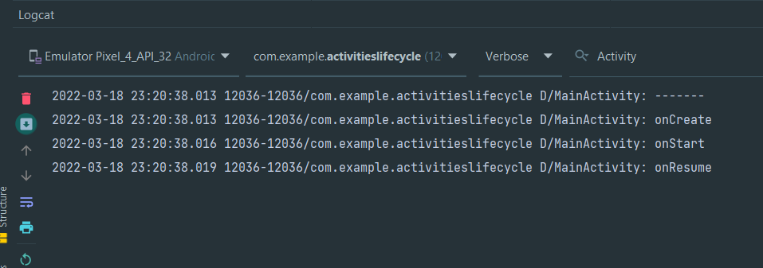
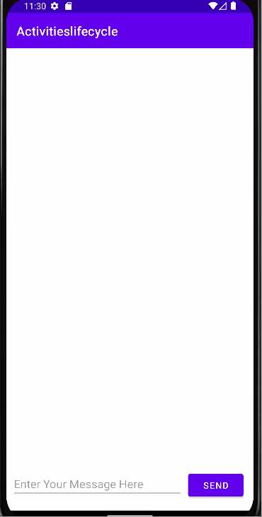
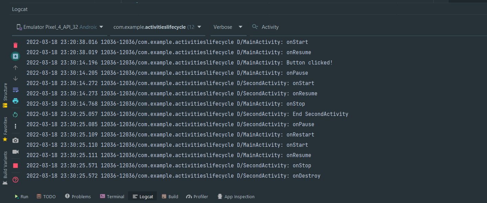
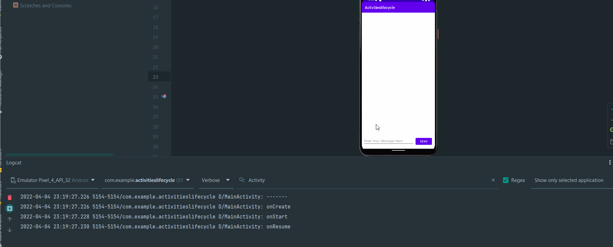
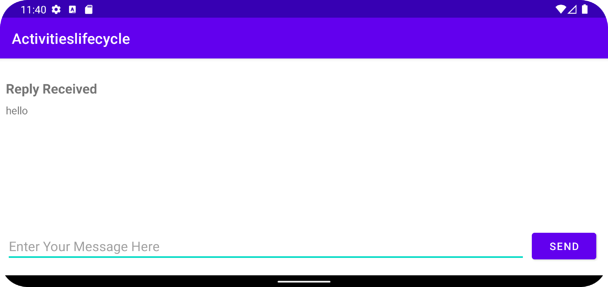
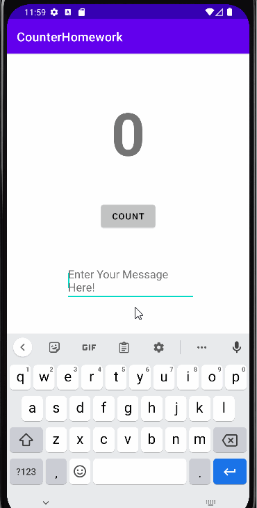
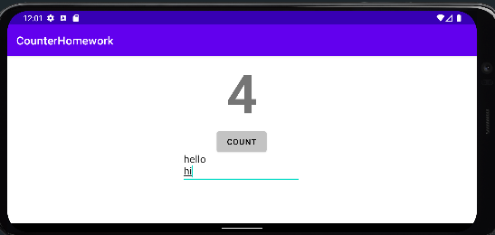
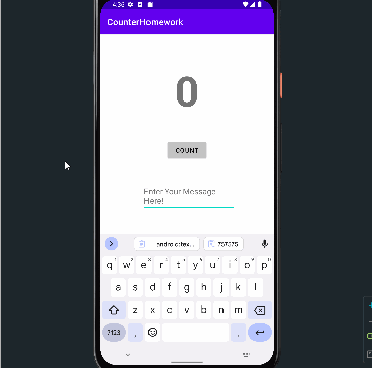

# Activity-lifecycle-and-state

## Task 1

When app is started

## Task 2

When using the app

When app is close

## Task 3

Save and restore the Activity instance state

## Coding Challenge

Shopping list app

## Homework

Counter homework

When Rotating the device the current state of the app is saved

## Answer these questions

### Question 1

If you run the homework app before implementing onSaveInstanceState(), what happens if you rotate the device?

Ans - The counter is reset to 0, but the contents of the EditText is preserved.

### Question 2

What Activity lifecycle methods are called when a device-configuration change (such as rotation) occurs? 

Ans -  Android shuts down your Activity by calling onPause(), onStop(), and onDestroy(), and then starts it over again, 
calling onCreate(), onStart(), and onResume().

### Question 3

When in the Activity lifecycle is onSaveInstanceState() called?

Ans - onSaveInstanceState() is called before the onStop() method.

### Question 4

Which Activity lifecycle methods are best to use for saving data before the Activity is finished or destroyed?

Ans - onPause() or onStop()

